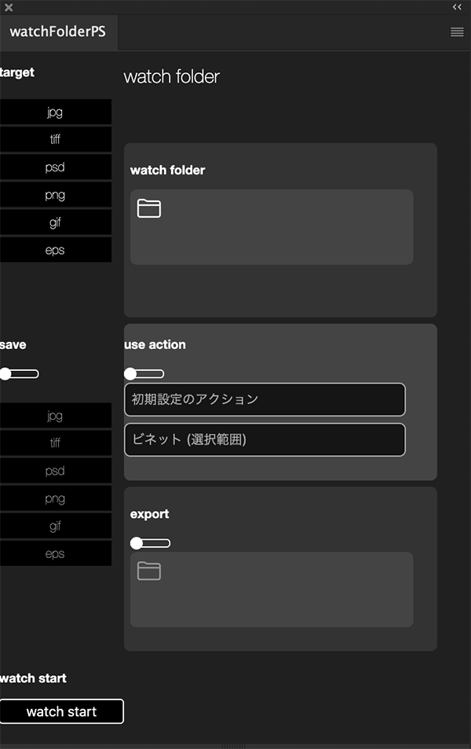

<h1>Extension Watch Folder PS</h1>

this is the Photoshop Extension to watch that image files are added in the folder

<h2>how to use it</h2>

select the folder you want to watch and choice options. like witch image type you target or use action etc... . after push watch button , the Extension watch folder you selected and when image is added in folder , open on Photoshop automatically

<h2>options</h2>
<ul>
    <li>
        <h3>targets</h3>
        
image formats. you select which format you target

    </li>
    <li>
        <h3>save</h3>
        
save fotmats. in case you turn on the switch, the Extension saves image as all of formats you selected after open it.

    </li>
    <li>
        <h3>action</h3>
        
it dispatches action after open an image.

    </li>
    <li>
        <h3>watch folder</h3>
        

            set the folder to watch. while the Extension is watching folder , Photoshop automatically opens an image you put in the folder.  
        

    </li>
    <li>
        <h3>export</h3>
        

            it exports image after open it. it must turn on with save options. without this option , the Extension makes folder and saves image in it. if you turn on it , the Extension'll save image in the folder you selected on this option. you can't set same folder with watch.
        

    </li>
</ul>

<h2>download packed file</h2>

download the zxp file blow the link and install use<a href="https://install.anastasiy.com/">Anastasiy’s Extension Manager</a>

<a href="kawano-shuji.com/strage/watchFolderPS_x2.zxp">watch folder PS</a>

Japanese Explanation is <a href="https://kawano-shuji.com/justdiary/2021/01/15/extension-watchfolderps-ver2/">here</a>
